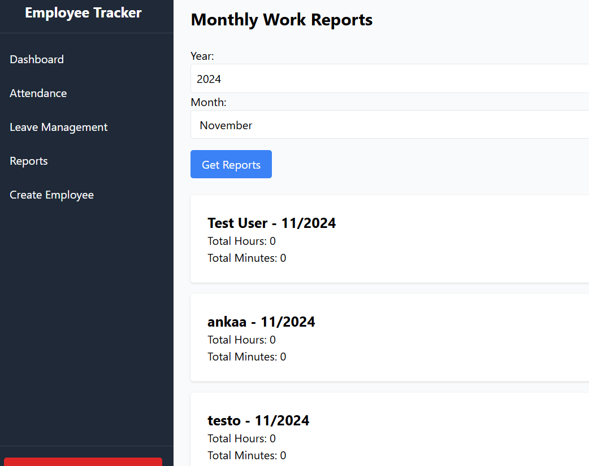

# Employee Tracker

## Components
1. **UI**: NGINX and React-based frontend [Go to UI README](./ui/README.md)
2. **API**: Go-based backend API [Go to API README](./api/README.md)
3. **Docker Compose**: Orchestration for multi-container Docker applications

## Tech
- Django(Python Framework)
- Celery(Task Manager)
- Celery Beat(Task Scheduler)
- Swagger(Documentation)
- Poetry(Python Dependency Environment)
- Ruff (Code Quality and Formatting)
- Web Socket(Push Notification)
- React (Frontend Framework)
- Tailwind CSS (Style management)
- ESLint
- Multi Stage Docker Containers
- NGINX

### Features
- Employee check-in/check-out tracking
- Annual leave management
- Holiday control
- Real-time notifications (WebSocket)
- Getting employee reports

## Websocket:
- WEB_SOCKET_URL=ws://localhost:8001/ws/notifications/
## API Endpoints
- POST /api/attendance/  - Check in/Check out
- GET /api/attendance/ - Get attendances
- GET /api/attendance/summary - Get attendances summary
 
- POST /api/emplyees/login/ - Login
- POST /api/emplyees/logout/ - Logout
- GET /api/employees/ - Get employee list
- POST /api/employees/create - Create employee
- POST /api/employees/token/refresh/ - Refresh - token

- GET /api/leave-management/ - Get leave list
- POST /api/leave-management/ - Create leave
- POST /api/leave-management/<int:pk>/- change-status/ - Change status for approve and - reject requests

- GET /api/notifications/ - Get notifications
- POST /api/notifications/<int:pk>/mark-as-read Mark notification
- GET /api/reports/monthly-work/ - Get monthly employee work reports for a given month

### Code Quality and Formatting
- make format: Formats code in the project with ruff.

### Setup Commands
- make setup-dev: Runs the setup.sh file in the backend container in the development environment.

- make setup-prod: Runs the setup.sh file in the backend container in the production environment.

- make changepassword-dev: Changes the password of the admin user for development environment.

- make changepassword-prod: Changes the password of the admin user for prod environment.

- make build-dev: Builds Docker containers for the development environment.

- make up-dev: Starts development environment containers.

- make stop-dev: Stops development environment containers.

- make down-dev: Deletes development environment containers and networks.

- make build-prod: Builds Docker containers for the production environment.

- make up-prod: Starts production environment containers.

- make stop-prod: Stops production environment containers.

- make down-prod: Deletes production environment containers and networks.

- make restart-dev: Restarts the development environment.

- make restart-prod: Restarts the production environment.

### Monitor Logs
Backend and Frontend Logs

#### Development Environment:
Backend: make logb-dev
Frontend: make logf-dev
#### Production Environment:
- Backend: make logb-prod
- Frontend: make logf-prod

#### Worker and Beat Logs:

- Worker Logs: make worker-logs
- Beat Logs: make beat_logs

#### Monitor All Docker Logs:

- make docker-logs
#### Geçici Dosyaları Temizleme
- make clean: Python geçici dosyalarını (.pyc, .pyo, __pycache__) temizler.

## Use Cases:
To start the development environment:
- make build-dev
- make up-dev

To start the production environment

- make build-prod
- make up-prod

To monitor backend logs:
- make logb-dev
To clear temporary files:
- make clean

Project Screenshots

## Additional
- Makefile added.
- Logger added.

## Future features
-  Error handling mechanism will be improved
-  Push Notifications web socket system will be improved

